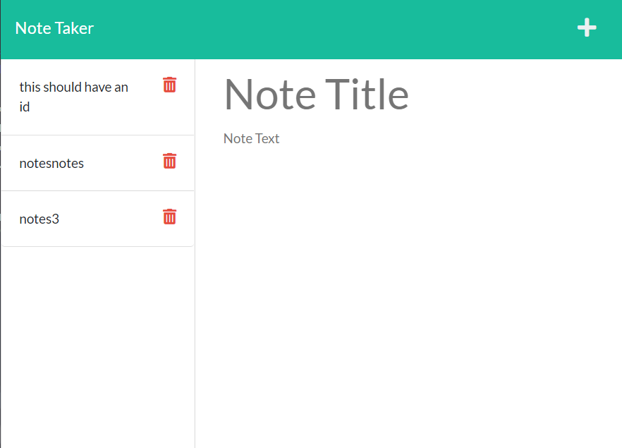
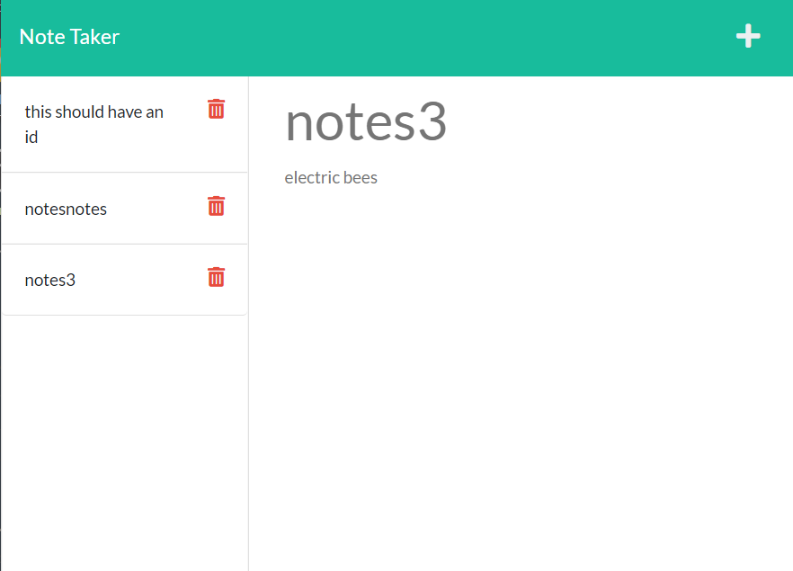

# note-taker

## Deployment Link

<a href="https://note-taker-darmstrong-72522.herokuapp.com/">Click here to access the note taker</a>

## Description

 

Purpose : 
- simple app to allow user to take notes and look back on them
- useful because it's easy to forget things and having a simple personal note taker makes things more private (which is valuable on the internet) and allows for a place to store info that is easy to keep track of

- uses get and post requests, fetch requests, etc

## Credits
Credit to my housemate Lyra, without whom I would be doing infinitely worse in this class and would have a far lesser understanding of the topics covered and used throughout our projects. Specifically to this project, credit to her for helping me orient myself, understand why the post requests are structured the way they are, and with the asynch.

## License
This project falls under the MIT license.

## Author
Damien Armstrong can be found on: <a href="https://www.linkedin.com/in/damien-armstrong-412319138/">Linkedin</a>, <a href="https://github.com/pirosvs">Github</a>